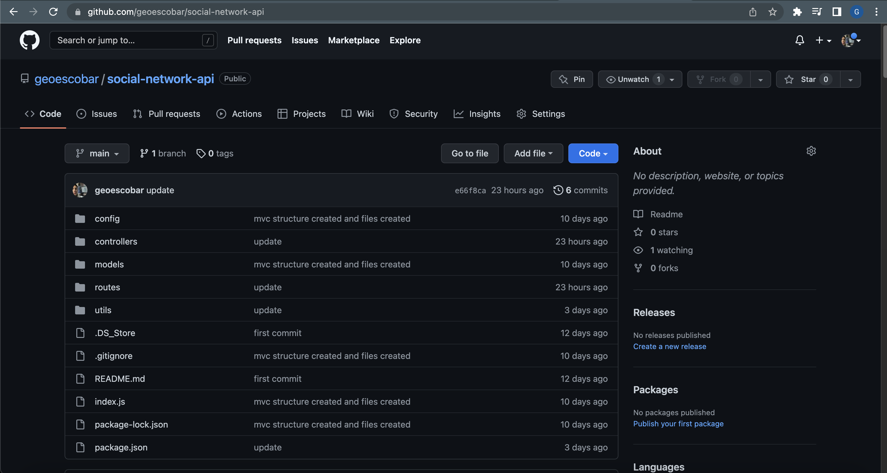
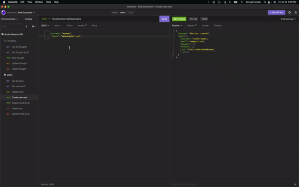

# Social Network API - NoSQL

## An API for a social network web application where users can share their thoughts, and create a friend list

## License


---

## Table of Contents:

- [License](#license)
- [Technologies](#technologies)
- [Installation](#installation)
- [Application](#application)
- [Contact](#contact)

---

## Technologies:

- Node
- MongoDB
- Mongoose
- Express.Js
- Insomnia

---

## Installation

##### This is a Node.Js based application. You can run the application using your integrated terminal.

1. Clone repo from GitHub

```
gh repo clone geoescobar/social-network-api
```

2. Install your dependencies

```
npm i
```

3. Start the server

```
npm start
```

---

## Application

#### [Github Repo](https://github.com/geoescobar/social-network-api)



#### [Screencastify](https://drive.google.com/file/d/1S9vip79GoECBN4KradmMrNQ2Qla76EdX/view)
If video doesn't load hit download to view



---

## Contact

##### If you have any questions about this repo or want to send a message my contact info is below!

- https://github.com/geoescobar
- geo.escobar214@gmail.com
